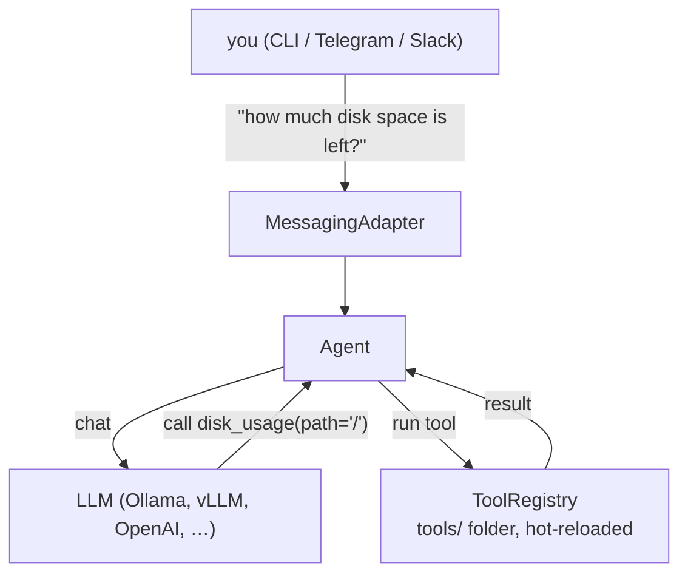

# SysBot

A local AI assistant you can chat with via CLI, Telegram, or Slack — extended by tools you drop into a folder.

Runs entirely on your machine with [Ollama](https://ollama.com). No cloud required.

---

## How it works

You chat in plain language; a local LLM decides which of your tools to run and
answers with the results:



A **tool** is just a Python function (or wrapped shell command) in a folder —
drop one into `tools/` and it's live, both as a `/slash` command and as
something the LLM can call. The three layers are independent: new chat
platforms are adapters, new LLM backends are a `base_url` change, new
abilities are files. The full walkthrough is in
[docs/architecture.md](docs/architecture.md).

**Features:**

- **Chat with a local LLM** — Ollama, vLLM, LlamaCpp, or OpenAI
- **Extend with copy-paste tools** — drop a tool folder (README + `tool.py`) into `tools/` and it's live, no restart
- **Install tools from GitHub** — `sysbot tools install owner/repo`; no git, no registry, just the link
- **Use tools without the LLM** — call any tool directly with `/tool_name args`
- **Cross-platform aware** — tools declare `platforms`/`requires` and explain themselves instead of failing
- **Confirmation prompts** — mark a tool `confirm=True` to require approval before it runs
- **Web dashboard** — `sysbot --dashboard` to manage tools and check LLM health
- **Structured traces** — every request logged to `logs/traces.jsonl` for debugging

---

## Quick start

**1. Install Ollama and pull a model**

```bash
curl -fsSL https://ollama.com/install.sh | sh    # Linux; see ollama.com for macOS/Windows
ollama pull llama3.2
```

See [docs/models.md](docs/models.md) to pick the right model for your hardware.

**2. Install SysBot** — the guided wizard writes `~/.sysbot/config.yaml` and
starts SysBot for you; **just press Enter through the prompts** for a working
local CLI bot:

```bash
bash scripts/install.sh        # Linux / macOS
```
```powershell
.\scripts\install.ps1          # Windows (PowerShell)
```

Prefer doing it by hand (`pip install .` + a config file)? Both paths are
walked through step by step in [Getting Started](docs/getting-started.md).

**3. Chat**

```bash
sysbot --provider cli
```

```
You: what's the disk usage on /?
Bot: The root filesystem has 45 GB free out of 200 GB total (78% used).

You: /disk_usage path=/tmp
Bot: Path: /tmp   Total: 20.0 GB   Free: 2.3 GB   Used: 11.0%
```

Type `/help` to list every tool; the day-to-day guide is
[Using SysBot](docs/usage.md).

**4. Add more tools**

```bash
sysbot tools install syan-dev/sysbot-linux-tools-official   # ping, DNS, traceroute, temps…
```

A running bot picks new tools up automatically. See
[Installing Tools](docs/installing-tools.md) — or write your own in a few
lines of Python: [Writing Tools](docs/writing-tools.md).

Every setting (model, backend, provider, history…) can be changed via
`config.yaml`, `SYSBOT_*` env vars, or CLI flags — see
[Configuration](docs/configuration.md).

---

## Documentation

The guides are ordered as a journey — full index at
**[docs/README.md](docs/README.md)**:

| Stage | Guides |
|---|---|
| **Understand** | [Architecture](docs/architecture.md) — the life of a message, where to change what |
| **Install** | [Getting Started](docs/getting-started.md) · [Models](docs/models.md) |
| **Use** | [Using SysBot](docs/usage.md) · [Adapters (CLI/Telegram/Slack)](docs/adapters.md) · [Dashboard](docs/dashboard.md) |
| **Extend** | [Writing Tools](docs/writing-tools.md) · [Installing Tools](docs/installing-tools.md) · [Sharing Tools](docs/sharing-tools.md) · [Configuration](docs/configuration.md) |
| **Operate** | [Running as a Service](docs/service.md) · [Building a Windows .exe](docs/building-windows-exe.md) |
| **Contribute** | [CONTRIBUTING.md](CONTRIBUTING.md) |

---

## Contributing

Most contributions don't touch the core: **a new tool** is a folder in
`tools/` (or your own repo — users install it with
`sysbot tools install you/repo`, no PR needed); **a new chat platform** is one
adapter file plus one `elif`; **core fixes** come with a test. Setup, checks,
and per-change checklists: [CONTRIBUTING.md](CONTRIBUTING.md).

## License

MIT
