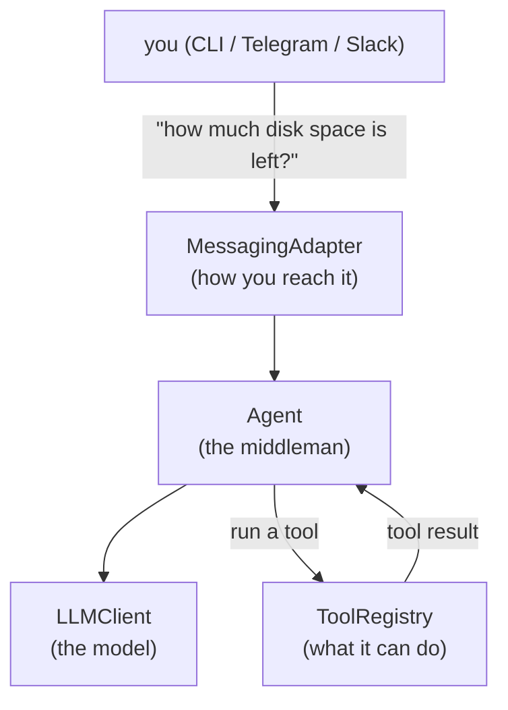
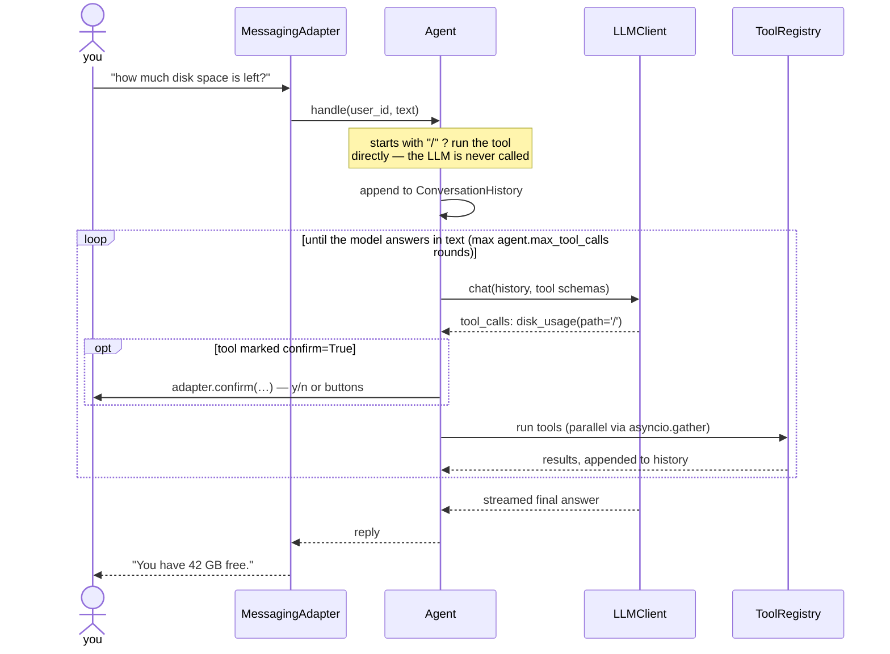
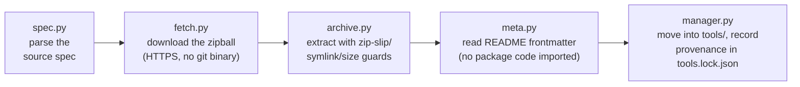

# Architecture — How LeSysBot Works

This guide explains what happens inside LeSysBot, from the moment you send a
message to the moment you get a reply. It goes **top-down**: first the big
picture, then the life of one message step by step, then each layer in detail,
and finally a map of *where to change what* when you want to modify it.

You don't need to read this to *use* LeSysBot — see [Using LeSysBot](usage.md) for
that. Read this when you want to understand, modify, or contribute to the code
(then continue to [CONTRIBUTING.md](../CONTRIBUTING.md)).

---

## 1. The big picture

LeSysBot is three independent layers wired together by one class, `Agent`:

- **MessagingAdapter** ([lesysbot/messaging/](../lesysbot/messaging/)) — where
  messages come from and where replies go: your terminal, Telegram, or Slack.
- **Agent** ([lesysbot/core/agent.py](../lesysbot/core/agent.py)) — the middleman.
  It keeps per-user conversation history, asks the LLM what to do, runs the
  tools the LLM asks for, and loops until there's a final answer.
- **LLMClient** ([lesysbot/llm/client.py](../lesysbot/llm/client.py)) — a thin
  wrapper around one OpenAI-compatible API. Ollama, vLLM, LlamaCpp, and OpenAI
  all speak this protocol, so there is no backend-specific code anywhere.
- **ToolRegistry** ([lesysbot/mcp/registry.py](../lesysbot/mcp/registry.py)) — the
  catalog of tools loaded from your `tools/` folder, with hot reload.

The layers only meet inside `Agent`, so each can be swapped or extended without
touching the others: a new chat platform is just a new adapter, a new LLM
backend is just a different `base_url`, and a new capability is just a file
dropped into `tools/`.

---

## 2. Startup — from `lesysbot` to a running bot

Everything starts in [lesysbot/__main__.py](../lesysbot/__main__.py):

1. **Parse the command line.** `build_parser()` handles the flags (`-c`, `-v`,
   `--provider`, `--model`, `--base-url`, `--dashboard`). If you ran a
   subcommand (`lesysbot tools …`), it's dispatched to the tools CLI before any
   bot setup — the bot never starts.
2. **Load settings.** `Settings.load()`
   ([lesysbot/core/config.py](../lesysbot/core/config.py)) finds the active config
   file (see [§7](#7-configuration--paths)), applies `LESYSBOT_*` environment
   variables, then applies CLI flags on top.
3. **Resolve paths.** Relative paths in the config (`./tools`, `logs/…`) are
   anchored to the directory the config file came from — so an installed setup
   uses `~/.lesysbot/tools`, and a dev checkout uses the repo's `tools/`.
4. **Set up logging.** A Rich console handler plus a time-rotating file handler
   on `logs/lesysbot.log` (see [§10](#10-logging--tracing)).
5. **Build the Agent.** `Agent.setup()` loads every tool from the tools
   directory and, with `hot_reload: true`, starts a watcher that reloads them
   whenever a `.py` file changes.
6. **Pick the adapter.** An `if/elif` on `messaging.provider` imports and
   constructs the CLI, Telegram, or Slack adapter. Adapters are imported
   *lazily* so a missing optional dependency doesn't break the others — the
   Telegram and Slack packages are the `telegram`/`slack` extras, and picking a
   provider you haven't installed names the extra to add.
7. **Wire confirmation.** `agent.set_confirm_fn(adapter.confirm)` connects the
   adapter's confirmation UI (terminal `y/n`, Telegram buttons) to the agent,
   so tools marked `confirm=True` can ask before running. The adapter's
   `send()` is also handed to `lesysbot/core/notify.py`, the out-of-band push
   channel: a tool can call `notify_later(text, delay)` to message the
   requesting user *after* its reply — the bundled `power` tool uses it to
   announce "powering off now" just before a scheduled shutdown fires.
8. **Run.** `await adapter.start(agent.handle)` blocks for the life of the
   process. If the dashboard is enabled, it runs as a *background* asyncio task
   beside the adapter and is cancelled when the adapter stops — that's why
   typing `exit` in the CLI actually ends the process. A second background
   task, the **startup notice** (Telegram/Slack only, on by default), waits
   for the adapter to connect and then pings the configured chat with a short
   system report — CPU/GPU temperature, disk usage, internet speed — so a
   service that starts at boot tells you the machine just came up (see
   [Running as a Service](service.md#the-startup-notice)).

---

## 3. The life of one message

This is the heart of LeSysBot — `Agent.handle(user_id, text)` in
[lesysbot/core/agent.py](../lesysbot/core/agent.py). Every message from every
adapter goes through the same steps:

**Step 1 — Slash commands take a shortcut.** If the text starts with `/`, it's
dispatched straight to `_handle_slash()`: the tool runs immediately and the
LLM is never called. This is why `/disk_usage path=/` works even when no model
is running, and why slash commands don't appear in conversation history.

**Step 2 — The message joins the history.** Each user has their own
`ConversationHistory`, seeded with the system prompt from the config and
trimmed to `agent.max_history` messages.

**Step 3 — Ask the LLM.** The agent sends the whole history to
`LLMClient.chat()`, along with a JSON schema for every enabled tool. The model
now has a choice: answer in text, or ask for tool calls.

**Step 4 — If the model answered in text, we're done.** The streamed text is
the reply; the adapter shows it to you.

**Step 5 — If the model asked for tools, run them.** For each requested call:

- If the tool is marked `confirm=True` (or a custom message), the agent first
  awaits `adapter.confirm(...)` — your `y/n` or button tap. Declined calls
  return "Cancelled by user." to the model instead of running.
- Tool calls run **in parallel** (`asyncio.gather`) unless any of them needs
  confirmation, in which case they run one at a time so each prompt can be
  answered cleanly.

**Step 6 — Feed the results back and loop.** Each tool result is appended to
the history as a `tool` message, and the agent goes back to Step 3 so the
model can interpret the results, call more tools, or write the final answer.
The loop is capped at `agent.max_tool_calls` rounds (default 10) so a confused
model can't spin forever.

**If anything fails** — the backend is down, the model doesn't exist — the
user gets a friendly `LLM unavailable: …` message reminding them that `/`
commands still work, and the full traceback goes to the log at DEBUG level.

Along the way, three optional callbacks keep the CLI display live: `on_status`
drives the `Thinking…` / `Running <tool>…` spinner, `on_token` streams the
answer text, and `on_reasoning` streams a reasoning model's thinking. Adapters
that don't pass them (Telegram, Slack) are simply unaffected.

---

## 4. The LLM layer — one client for every backend

[lesysbot/llm/client.py](../lesysbot/llm/client.py) holds a single `AsyncOpenAI`
client with a configurable `base_url`. That's the whole trick: Ollama, vLLM,
and LlamaCpp all expose an OpenAI-compatible API, so switching backends is a
config change, not a code change:

| Backend | `base_url` | `api_key` |
|---|---|---|
| Ollama | `http://localhost:11434/v1` | `ollama` (any string) |
| vLLM | `http://localhost:8000/v1` | `vllm` (any string) |
| OpenAI | `https://api.openai.com/v1` | your real key |

Details worth knowing before you modify it:

- **It always streams** (`stream=True`), accumulating text and tool-call
  fragments from the deltas — that's what makes live rendering possible.
- **`health()`** is a separate non-streaming probe used by the dashboard: it
  times a `models.list()` call with a short 5 s timeout and reports whether
  the backend is reachable and whether your configured model is present.

---

## 5. The tool layer — registry, decorator, gating

### 5.1 What a tool is

A tool is a Python function (or a wrapped shell command) with a name, a
description, and a JSON schema for its parameters. The LLM sees the schemas
and picks tools by name; the `/slash` dispatcher uses the same catalog.

Two ways to define one (full guide: [Writing Tools](writing-tools.md)):

- **`@tool`** ([lesysbot/mcp/decorators.py](../lesysbot/mcp/decorators.py)) —
  decorates a Python function and builds the parameter schema from its type
  hints. Sync functions are wrapped in async automatically.
- **`CLITool`** ([lesysbot/mcp/cli_tool.py](../lesysbot/mcp/cli_tool.py)) — wraps
  a shell command template (`"ping -c 3 {host}"`) with named parameters and a
  timeout.

### 5.2 How tools are discovered

At startup (and on every hot reload), `ToolRegistry.load_directory()`
([lesysbot/mcp/registry.py](../lesysbot/mcp/registry.py)) scans the tools
directory:

1. Every non-`_`-prefixed `.py` file directly in `tools/` is imported (quick
   local tools).
2. Every subdirectory is loaded as a **folder package** — the shareable form
   with its own `README.md`, `tool.py`, and optional `_helpers.py`. Each
   package's directory is put on `sys.path` during its load, so it can
   `from _helpers import …` without clashing with another package's helpers.
3. Anything exposing `__tool_meta__` (set by `@tool`) or that *is* a `CLITool`
   instance gets registered.

With `mcp.hot_reload: true` (the default), a `watchfiles` watcher re-runs this
whenever a `.py` under `tools/` changes — save a file and the tool is live.

### 5.3 Cross-platform gating

Tools can declare `platforms=["linux", …]` and `requires=["nvidia-smi", …]`
(PATH binaries, checked with `shutil.which` in
[lesysbot/mcp/platform.py](../lesysbot/mcp/platform.py)). A tool that can't run on
the current machine is **still registered** — it shows up in `/help` and to
the LLM — but calling it returns a one-line explanation instead of a cryptic
failure. Pip dependencies are *not* `requires` entries; tools import them and
handle `ImportError` themselves.

### 5.4 Enable/disable

The [dashboard](dashboard.md) can toggle tools off. A disabled tool is hidden
from the LLM's schemas and refuses direct `/` calls; the choice is persisted
to `tool_state.json` so it survives restarts and hot reloads.

---

## 6. The messaging layer — adapters

Every adapter implements the same tiny interface
([lesysbot/messaging/base.py](../lesysbot/messaging/base.py)):

- `start(handler)` — connect to the platform and call
  `await handler(user_id, text)` for each incoming message.
- `send(user_id, text)` — deliver a reply.
- `confirm(user_id, tool_name, prompt, args)` — *optional*; show a
  confirmation UI for `confirm=True` tools. The default auto-approves.

The three built-ins:

- **CLI** ([lesysbot/messaging/cli.py](../lesysbot/messaging/cli.py)) — reads
  stdin, renders streamed answers as live Markdown with a status spinner, and
  prints slash-command output verbatim so column layouts survive.
- **Telegram** ([lesysbot/messaging/telegram.py](../lesysbot/messaging/telegram.py))
  — the `telegram` extra (python-telegram-bot v20+), an `allowed_user_ids`
  allow-list, and ✅/❌
  inline buttons for confirmation. Malformed Markdown falls back to plain text
  so no reply is ever dropped.
- **Slack** ([lesysbot/messaging/slack.py](../lesysbot/messaging/slack.py)) —
  Socket Mode DMs (the `slack` extra: `slack-bolt` + `aiohttp`).

Adding a platform means subclassing the base and adding one `elif` in
`__main__.py` — the step-by-step is in
[Messaging Adapters §4](adapters.md#4-building-a-custom-adapter).

---

## 7. Configuration & paths

Two modules decide *which settings apply* and *where files live*:

**[lesysbot/core/config.py](../lesysbot/core/config.py)** — `Settings.load()`
searches, in order: the `-c` flag → `./config.yaml` → `~/.lesysbot/config.yaml`
(what the installer writes) → `config.yaml` next to a frozen `.exe` →
`config/default.yaml` → built-in defaults. Every field can also be overridden
by a `LESYSBOT_` environment variable (`LESYSBOT_LLM__MODEL=…`, `__` = nesting)
and by CLI flags, in that order of increasing precedence. The loaded file's
directory is remembered as `config_dir`.

**[lesysbot/core/paths.py](../lesysbot/core/paths.py)** — relative paths in the
config (`./tools`, `logs/lesysbot.log`) are anchored to that `config_dir`. This
one rule makes all three deployment shapes work unchanged:

| Setup | Active config | `./tools` resolves to |
|---|---|---|
| Installed (wizard) | `~/.lesysbot/config.yaml` | `~/.lesysbot/tools/` |
| Dev checkout | `./config.yaml` in the repo | the repo's `tools/` |
| Frozen `.exe` | `config.yaml` next to the exe | `tools\` next to the exe |

`~/.lesysbot/` is the stable per-user home (override with `LESYSBOT_HOME`); the
full reference is in [Configuration](configuration.md).

---

## 8. The tool installer

`lesysbot tools install owner/repo` ([lesysbot/install/](../lesysbot/install/))
downloads a tool folder package from GitHub **into the same tools directory
the bot loads** — so a running bot picks it up via hot reload. The pipeline,
one module per stage:

User guide: [Installing Tools](installing-tools.md); trust model included.

---

## 9. The dashboard

An optional local web UI ([lesysbot/dashboard/server.py](../lesysbot/dashboard/server.py),
enabled with `--dashboard`) that shows every tool's status, toggles them
on/off, and probes LLM health. It runs as a background asyncio task beside the
messaging adapter and reads everything through the `Agent.registry` /
`Agent.llm` properties — it has no state of its own. It binds `127.0.0.1`
only, with no auth. User guide: [Dashboard](dashboard.md).

---

## 10. Logging & tracing

Two independent records of what happened
(paths anchored like everything else — `~/.lesysbot/logs/` when installed):

- **`logs/lesysbot.log`** — the plain-text application log, rotated on a timer
  (`logging.when`, default midnight; `logging.backup_count` files kept). In an
  interactive CLI session the *console* only shows warnings so chat stays
  clean; the *file* always gets the configured `logging.level`.
- **`logs/traces.jsonl`** ([lesysbot/core/trace.py](../lesysbot/core/trace.py)) —
  one JSON line per user message: every LLM turn, every tool call with its
  arguments and duration, and the final reply. This is the first place to look
  when you're debugging *what the model decided to do*. Format reference:
  [Configuration §6](configuration.md#6-traces-log-format).

---

## 11. Where to change what

| I want to… | Touch | Guide |
|---|---|---|
| Add a capability (new tool) | a new folder in `tools/` — no core code | [Writing Tools](writing-tools.md) |
| Share a tool with others | a GitHub repo — nothing else | [Sharing Tools](sharing-tools.md) |
| Support a new chat platform | new file in [lesysbot/messaging/](../lesysbot/messaging/) + one `elif` in [lesysbot/__main__.py](../lesysbot/__main__.py) | [Adapters §4](adapters.md#4-building-a-custom-adapter) |
| Support a new LLM backend | usually nothing — set `llm.base_url` | [Configuration §3](configuration.md#3-llm-backends) |
| Change the tool-calling loop, history, confirmations | [lesysbot/core/agent.py](../lesysbot/core/agent.py) | this page, [§3](#3-the-life-of-one-message) |
| Change tool discovery, gating, hot reload | [lesysbot/mcp/registry.py](../lesysbot/mcp/registry.py) | this page, [§5](#5-the-tool-layer--registry-decorator-gating) |
| Add a config setting | [lesysbot/core/config.py](../lesysbot/core/config.py) + `config/default.yaml` + [configuration.md](configuration.md) | [CONTRIBUTING.md](../CONTRIBUTING.md) |
| Change the install wizard | `scripts/install.sh` **and** `scripts/install.ps1` (kept in sync) | [CONTRIBUTING.md](../CONTRIBUTING.md) |

---

## Next steps

- Ready to make a change? Follow the step-by-step in
  [CONTRIBUTING.md](../CONTRIBUTING.md) — dev setup, tests, lint, PR checklist.
- Writing a tool is the gentlest entry point: [Writing Tools](writing-tools.md).
- The AI-assistant-oriented notes in [CLAUDE.md](../CLAUDE.md) cover the same
  ground at a finer grain (module internals, edge cases) if you need more depth.
